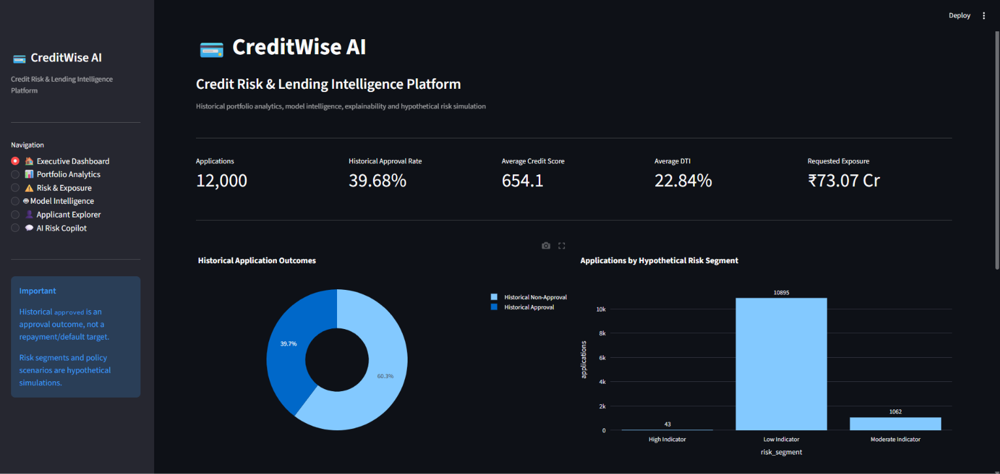
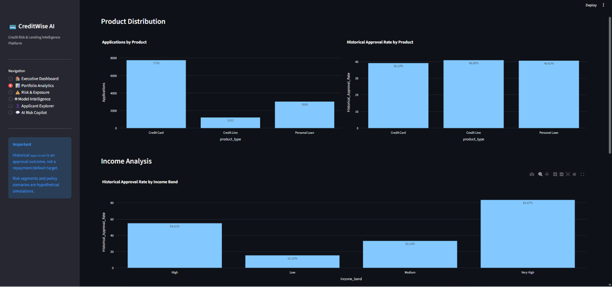
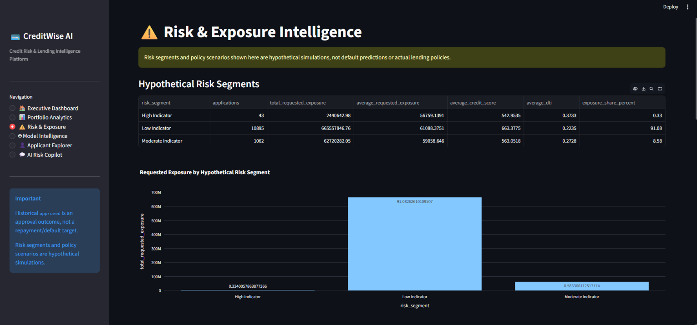
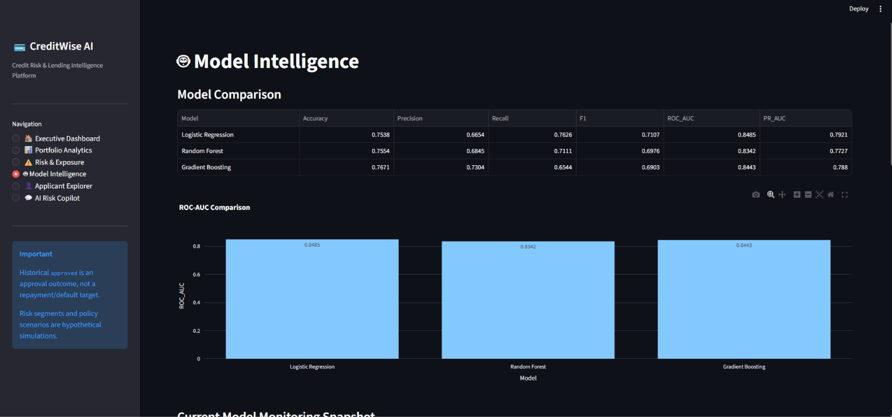
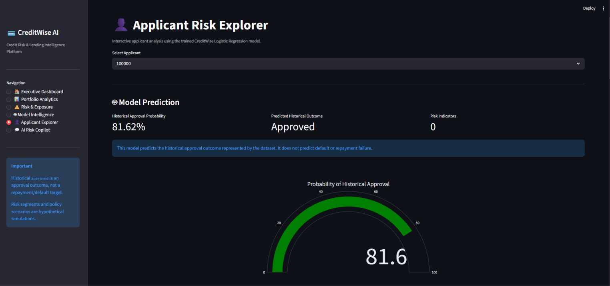

# 💳 CreditWise AI — End-to-End Credit Risk & Lending Intelligence Platform

> **Data Engineering + SQL + Machine Learning + Explainable AI + Risk Analytics + Model Monitoring + Streamlit + Gemini AI**

CreditWise AI is an end-to-end portfolio project that transforms credit-application data into an integrated analytics, machine-learning, explainability, risk-simulation, monitoring, and AI-assistant platform.

The platform is designed around a fictional banking scenario in which analysts need to understand **historical approval outcomes**, investigate applicant-level model predictions, explore hypothetical risk indicators, monitor model performance, and interact with model outputs using an AI Risk Copilot.

---

## ⚠️ Important Data & Risk Disclaimer

This is a portfolio / demonstration project.

- `approved` represents a **historical approval outcome**, not loan default or repayment.
- The dataset does **not** contain an actual repayment/default target.
- Risk segments and policy scenarios are **hypothetical simulations**.
- Several fields were synthetically enriched for demonstration and are explicitly marked as synthetic.
- SHAP values describe model influence, not causation.
- Model probabilities are not calibrated real-world lending probabilities.
- The application is not intended to make actual lending decisions.

---

---

# 🖥️ Dashboard Screenshots

The repository includes selected screenshots from the working CreditWise AI Streamlit application.

### Executive Dashboard



### Portfolio Analytics



### Risk & Exposure Intelligence



### Model Intelligence



### Applicant Explorer



> These are selected representative screenshots. Additional dashboard views are available when the Streamlit application is run locally.


# 🎯 Business Problem

Credit applications contain information about income, employment, credit history, debt, utilization, and applicant characteristics. A lending analytics platform should help analysts answer questions such as:

- What does the historical approval portfolio look like?
- How do historical approval outcomes vary across product, income, credit-score, and DTI segments?
- Which applications contain multiple hypothetical risk indicators?
- How much requested exposure falls into each hypothetical risk segment?
- Which features influence an individual model prediction?
- How does the model perform across standard classification metrics?
- Can analysts ask natural-language questions about model outputs?

CreditWise AI combines these workflows into one application.

---

# 🏗️ End-to-End Architecture

```text
                    CREDIT APPLICATION DATA
                              │
                              ▼
                    Python Data Quality / ETL
                              │
                              ▼
                       PostgreSQL Layers
                    RAW → STAGING → WAREHOUSE
                              │
                              ▼
                       SQL Analytics Layer
                              │
              ┌───────────────┴───────────────┐
              ▼                               ▼
       Feature Engineering              Business Analytics
              │
              ▼
        Model Training
              │
        ┌─────┴──────┐
        ▼            ▼
   Model Scoring   SHAP / XAI
        │            │
        └─────┬──────┘
              ▼
       Risk Simulation
              │
              ▼
       Model Monitoring
              │
              ▼
       Streamlit Dashboard
              │
              ▼
       Gemini AI Risk Copilot
```

---

# 🧰 Technology Stack

| Area | Technologies |
|---|---|
| Programming | Python |
| Data Processing | Pandas, NumPy |
| Database | PostgreSQL |
| SQL | PostgreSQL SQL |
| Machine Learning | Scikit-learn |
| Models | Logistic Regression, Random Forest, Gradient Boosting |
| Explainability | SHAP |
| Visualization | Plotly |
| Dashboard | Streamlit |
| Generative AI | Google Gemini API |
| Serialization | Joblib |
| Development | Jupyter Notebook |
| Version Control | Git, GitHub |

---

# 📊 Dataset

The final enriched dataset contains:

- **12,000 applications**
- **44 columns**
- Source attributes
- Synthetic enrichment fields
- Derived analytical features

### Core source fields

Examples include:

- Applicant ID
- Gender
- Age
- Number of children
- Family size/status
- Education
- Housing
- Car/property ownership
- Income type
- Occupation
- Annual income
- Years employed
- Credit history months
- Existing credit lines
- Debt-to-income ratio
- Late payments
- Email/work-phone indicators
- Historical approval outcome

### Synthetic enrichment fields

The project adds demonstration fields including:

- Application date
- Product type
- Requested credit limit
- Application channel
- Application purpose
- Monthly debt obligation
- Monthly expenses
- Total outstanding debt
- Current credit limit
- Current credit balance
- Credit score

Synthetic fields are marked in the dataset for lineage and transparency.

---

# 🧹 Data Quality & Cleaning

The data-quality workflow validates:

- Duplicate rows
- Duplicate applicant IDs
- Missing values
- Invalid dates
- Credit-score ranges
- DTI ranges
- Credit-utilization ranges
- Age ranges
- Income ranges
- Credit-history ranges
- Late-payment ranges

Cleaning includes:

- Missing categorical values → `Unknown`
- Missing `years_employed` → median imputation within `income_type`
- Whitespace normalization in categorical fields

Cleaned output:

```text
data/processed/creditwise_cleaned.csv
```

---

# 🗄️ PostgreSQL Data Engineering

The database follows a layered architecture:

```text
RAW
 ↓
STAGING
 ↓
WAREHOUSE
 ↓
ANALYTICS
```

### RAW

```text
raw.credit_applications
```

Stores the enriched source-level data.

### STAGING

```text
staging.credit_applications
```

Contains cleaned, trimmed, model-ready staging data.

### WAREHOUSE

The warehouse uses a dimensional model:

```text
dim_applicant
dim_product
dim_date
fact_application
```

### ANALYTICS

Business-facing tables include:

```text
approval_summary
product_summary
risk_segment_summary
channel_summary
monthly_portfolio_summary
applicant_risk_summary
```

---

# 📈 SQL Business Analytics

SQL analysis covers:

- Historical approval rate
- Application volume
- Product-level application and approval analysis
- Income-band analysis
- Credit-score bands
- DTI bands
- Credit-utilization segments
- Payment-risk indicators
- Requested exposure
- Applicant risk segments

### Portfolio snapshot

| Metric | Value |
|---|---:|
| Applications | 12,000 |
| Unique applicants | 12,000 |
| Historical approval rate | 39.68% |
| Average credit score | 654.07 |
| Average DTI | 22.84% |
| Average utilization | 22.25% |
| Average requested limit | ₹60,893 |
| Total requested exposure | ~₹730.72M / ₹73.07 Cr |

These figures describe the project dataset only and are not real-world lending statistics.

---

# 🧠 Feature Engineering

The feature pipeline creates model-ready features such as:

- `application_year`
- `application_month`
- `dti_percent`
- `utilization_percent`
- `requested_limit_to_income`
- `disposable_income_ratio`
- `exposure_to_income`

Categorical features are one-hot encoded.

Numerical features use median imputation and standard scaling.

Categorical features use most-frequent imputation and one-hot encoding.

Final processed feature count:

```text
77 features
```

The saved preprocessing pipeline is:

```text
data/outputs/preprocessor.pkl
```

---

# 🤖 Machine Learning

Three classification models were evaluated on the historical approval target.

## Logistic Regression

| Metric | Score |
|---|---:|
| Accuracy | 0.7538 |
| Precision | 0.6654 |
| Recall | 0.7626 |
| F1 | 0.7107 |
| ROC-AUC | 0.8485 |
| PR-AUC | 0.7921 |

## Random Forest

| Metric | Score |
|---|---:|
| Accuracy | 0.7554 |
| Precision | 0.6845 |
| Recall | 0.7111 |
| F1 | 0.6976 |
| ROC-AUC | 0.8342 |
| PR-AUC | 0.7727 |

## Gradient Boosting

| Metric | Score |
|---|---:|
| Accuracy | 0.7671 |
| Precision | 0.7304 |
| Recall | 0.6544 |
| F1 | 0.6903 |
| ROC-AUC | 0.8443 |
| PR-AUC | 0.7880 |

Logistic Regression was carried forward as the final application model based on the evaluation criteria used in this project, particularly ROC-AUC, PR-AUC, and class-1 recall. This is a project-specific model-selection decision, not a claim that Logistic Regression is universally superior for lending.

Final artifacts:

```text
data/outputs/final_model.pkl
data/outputs/preprocessor.pkl
```

---

# 🔍 Explainable AI — SHAP

SHAP is used to explain both global model behavior and individual predictions.

### Global feature influence

Important features in the project include:

- Debt-to-income ratio
- Income type
- Annual income
- Years employed
- Monthly expenses
- Property ownership
- Monthly debt obligation
- Credit history months
- Disposable income

### Applicant-level explanation

For an individual applicant, SHAP shows which features push the model toward the historical approval or non-approval class.

> SHAP values describe model influence. They should not be interpreted as causal effects.

Because the dataset includes synthetic enrichment, observed relationships should not be interpreted as real-world lending causality.

---

# ⚠️ Risk & Exposure Simulator

The project includes a rule-based **hypothetical** risk-indicator engine.

Indicators include:

```text
DTI > 50%
Utilization > 75%
Late payments >= 3
Credit score < 580
```

Risk-indicator segments:

```text
0 indicators  → Low Indicator
1 indicator   → Moderate Indicator
2+ indicators → High Indicator
```

### Hypothetical screening scenarios

```text
Broad Screening
Balanced Screening
Strict Screening
```

The simulator estimates eligible applications and requested exposure under these demonstration rules.

It is **not** a default model, credit policy, underwriting policy, or actual lending recommendation.

---

# 📊 Model Monitoring

The project establishes a baseline monitoring framework using the saved test dataset.

Tracked metrics:

- Accuracy
- Precision
- Recall
- F1
- ROC-AUC
- PR-AUC
- Prediction distribution
- Feature monitoring

Baseline metrics:

```text
Accuracy:  0.75375
Precision: 0.66545
Recall:    0.76261
F1:        0.71072
ROC-AUC:   0.84851
PR-AUC:    0.79210
```

A true production drift dataset is not available in this portfolio project, so monitoring is presented as a baseline framework rather than a live production drift-monitoring system.

---

# 📱 Streamlit Dashboard

The Streamlit application contains six major areas.

## 1. Executive Dashboard

High-level portfolio KPIs, historical approval outcomes, requested exposure, and hypothetical risk-segment distribution.


## 2. Portfolio Analytics

Product, income, and DTI analysis with interactive Plotly charts.


## 3. Risk & Exposure

Hypothetical risk segments, requested exposure, and screening scenarios.


## 4. Model Intelligence

Model comparison, monitoring metrics, and global SHAP feature importance.


## 5. Applicant Risk Explorer

Select an applicant and inspect the model's historical approval prediction and probability.


Applicant profile and hypothetical indicators:


Applicant-level SHAP explanation:


## 6. AI Risk Copilot

The dashboard includes an AI Risk Copilot that can answer natural-language questions using the project's actual applicant data, model output, risk indicators, and SHAP explanation.

Example prompts include:

```text
Why was this applicant predicted this way?

What are the main risk factors?

Summarize this applicant.

Explain the model prediction.
```

The Copilot is designed to explain the model rather than make real lending decisions.


---

# 🤖 AI Risk Copilot Architecture

```text
Applicant Record
      │
      ├── Model Prediction
      ├── Historical Approval Probability
      ├── Risk Indicators
      └── SHAP Explanation
              │
              ▼
        Copilot Context Builder
              │
              ▼
          Gemini API
              │
              ▼
     Natural-Language Explanation
```

The Copilot prompt is designed to prevent unsupported claims and to maintain the project's distinction between historical approval, hypothetical risk indicators, and actual default/repayment risk.

---

# 📁 Project Structure

```text
creditwise/
│
├── app/
│   └── streamlit_app.py
│
├── data/
│   ├── raw/
│   ├── processed/
│   └── outputs/
│
├── notebooks/
│   ├── 01_data_understanding.ipynb
│   ├── 02_data_quality_cleaning.ipynb
│   ├── 03_postgresql_etl.ipynb
│   ├── 04_sql_business_analytics.ipynb
│   ├── 05_feature_engineering.ipynb
│   ├── 06_model_training.ipynb
│   ├── 07_shap_explainability.ipynb
│   ├── 08_risk_simulation.ipynb
│   └── 09_model_monitoring.ipynb
│
├── sql/
│   ├── 01_database_setup.sql
│   ├── 02_raw_tables.sql
│   ├── 03_staging_tables.sql
│   ├── 04_warehouse_tables.sql
│   └── 05_analytics_tables.sql
│
├── src/
│   ├── features/
│   │   └── feature_pipeline.py
│   ├── models/
│   │   ├── explainability.py
│   │   └── scoring.py
│   └── risk/
│       ├── ai_copilot.py
│       ├── copilot.py
│       └── gemini_client.py
│
├── docs/
│   └── screenshots/
│
├── rebuild_preprocessor.py
├── .gitignore
└── README.md
```

---

# ⚙️ Setup

## 1. Clone the repository

```bash
git clone <YOUR_GITHUB_REPOSITORY_URL>
cd creditwise
```

## 2. Install dependencies

```bash
pip install -r requirements.txt
```

## 3. Configure Gemini

Create a local `.env` file:

```env
GEMINI_API_KEY=your_api_key_here
```

Never commit the `.env` file or expose the API key publicly.

The repository `.gitignore` excludes environment variables and credential files.

## 4. PostgreSQL

Create the `creditwise` database and execute the SQL scripts in order:

```text
sql/01_database_setup.sql
sql/02_raw_tables.sql
sql/03_staging_tables.sql
sql/04_warehouse_tables.sql
sql/05_analytics_tables.sql
```

The notebooks document the ETL and analytics workflow.

---

# ▶️ Run the Streamlit Application

From the project root:

```bash
python -m streamlit run app/streamlit_app.py
```

The application opens in the browser and provides the complete CreditWise AI dashboard.

---

# 🧪 Notebook Workflow

The project follows this development sequence:

```text
01 → Data Understanding
02 → Data Quality & Cleaning
03 → PostgreSQL ETL
04 → SQL Business Analytics
05 → Feature Engineering
06 → Model Training
07 → SHAP Explainability
08 → Risk Simulation
09 → Model Monitoring
```

The Streamlit application consumes the resulting model, preprocessing, analytics, SHAP, risk, and monitoring outputs.

---

# 🔐 Security & Reproducibility

The repository uses:

- `.env` for local API credentials
- `.gitignore` for secrets and temporary artifacts
- Saved model and preprocessing artifacts for application scoring
- Reproducible feature-engineering logic
- Notebook-based development workflow
- PostgreSQL SQL scripts for the database layer

Secrets are intentionally excluded from version control.

---

# 🚀 Future Enhancements

Potential next steps include:

- Real repayment/default data
- Probability calibration
- Production data-drift monitoring
- Automated model retraining
- Fairness and subgroup analysis
- Threshold optimization
- Feature-store integration
- Real-time scoring API
- Docker deployment
- CI/CD pipeline
- Cloud deployment
- Production-grade RAG knowledge base
- Automated data-quality alerts

---

# 💼 Skills Demonstrated

```text
Python
Pandas
NumPy
SQL
PostgreSQL
ETL / ELT
Data Quality
Data Modeling
Feature Engineering
Machine Learning
Scikit-learn
Explainable AI
SHAP
Risk Analytics
Model Monitoring
Streamlit
Plotly
Generative AI
Gemini API
Jupyter
Git
GitHub
```

---

# ⭐ Project Summary

CreditWise AI demonstrates an end-to-end workflow for turning raw credit-application data into an integrated analytics and AI platform:

```text
Raw Data
   ↓
Data Quality
   ↓
PostgreSQL ETL
   ↓
SQL Analytics
   ↓
Feature Engineering
   ↓
Machine Learning
   ↓
SHAP Explainability
   ↓
Hypothetical Risk Simulation
   ↓
Model Monitoring
   ↓
Streamlit Dashboard
   ↓
Gemini AI Risk Copilot
```

The project is intended to demonstrate practical **Data Engineering, Data Analysis, Machine Learning, Explainable AI, and Generative AI integration** skills in a single portfolio application.
